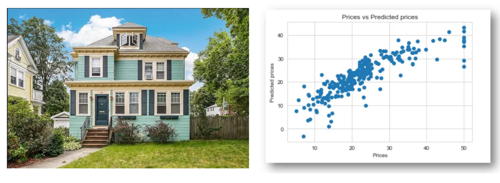
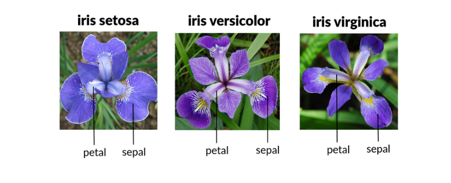
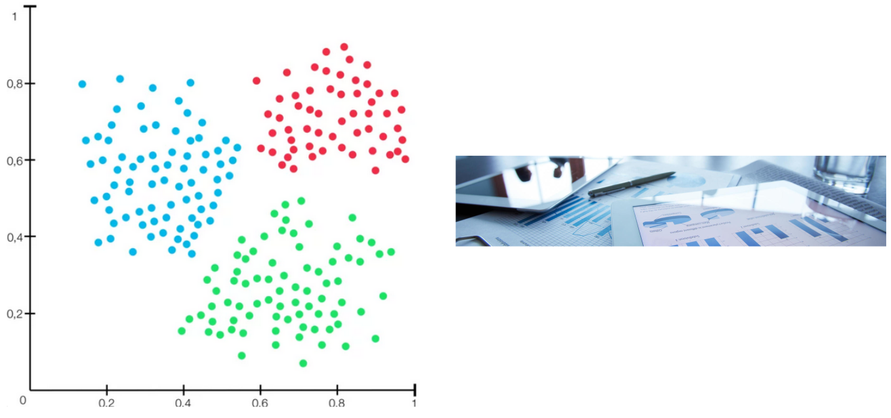
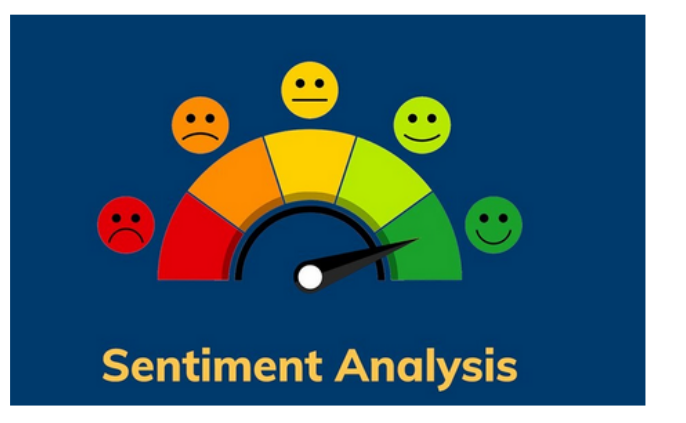
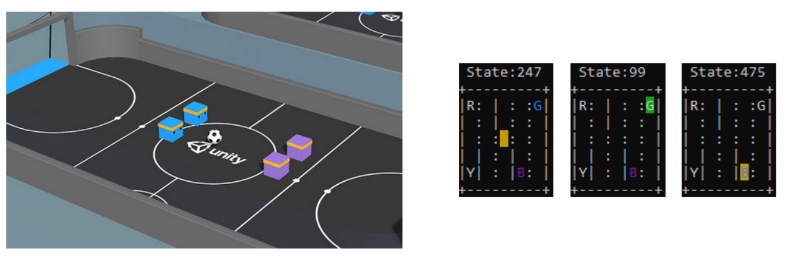
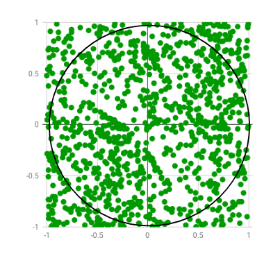
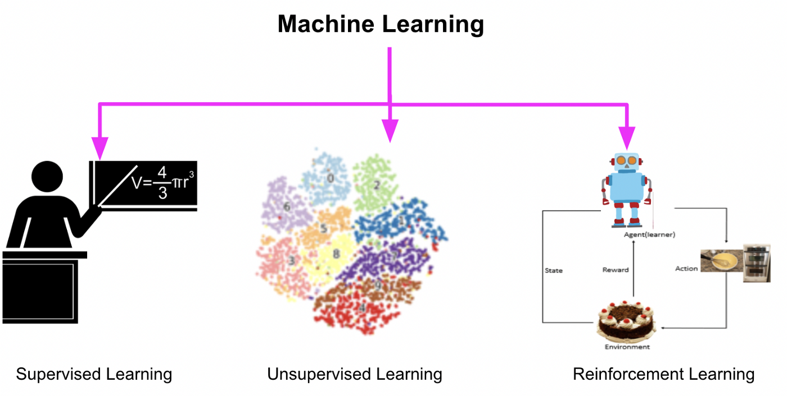
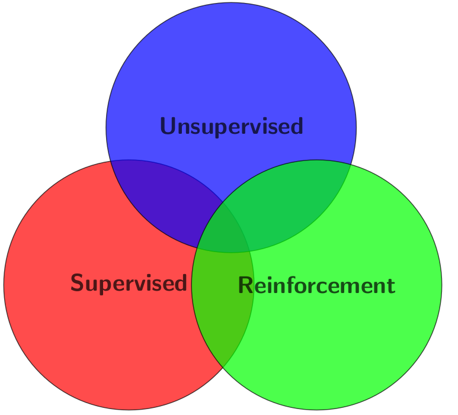

# Introduction to Machine Learning

The goal of this book is to help you to establish a problem and turn it into a machine learning problem, each section will have some big project to do, and for the subsection they will always have programming codes.

Here are some projects (we will have much more) that we are going to explore on our journey.

### [Boston House Prices](https://www.kaggle.com/datasets/vikrishnan/boston-house-prices)


### [Iris Classification](https://www.kaggle.com/datasets/uciml/iris)


### Handwritten Digit Recognition


### [Spotify Tracks Dataset](https://www.kaggle.com/datasets/maharshipandya/-spotify-tracks-dataset)


### Customer Clustering and Segmentation


### Sentiment Analysis


### AI playing games



### Tech Skills
* Python, Pandas, NumPy, SciPy, Spark, SQL
* Sckit-learn, Seaborn, matplotlib, Optuna, SHAP
* OpenCV, PyTorch, TensorFlow
* AWS, Cloud

### Prerequisites
* Programming knowledge (python preferred)
* Calculus, Linear Algebra,
* Statistics, Probabilities

## Definition of Machine Learning

In 1959 Arthur Samuel created one of the first definitions of 

*"Machine Learning is the field of study that gives the computer the ability to learn without being explicitly programmed".*

So what does this mean? That means that we cannot hard-code the solutions to our problem with a bunch of if-else, for example, a machine needs to 'learn' without being tell-it. 

Suppose that you need to find the value of $\pi$, you can just write and code that would contain his value.

```python
pi = 3,14159...
```

Or you can use some data and create an algorithm that estimates this value. There is a way to use random points to calculate this value.

We have a circle centered on (0,0) with radius $r$ and a square with side $2r$ let $r=1$ The area of the circle is $\pi$ and the area of the square is 4, so



$$ \frac{\text{area of circle}}{\text{area of square}}= \frac{\pi}{4} $$

With a very large number of generated points
$$ \pi = 4\times\frac{\text{number of points inside the circle}}{\text{number of points inside square}} $$

```python
import random
 
n_max = 1000
circle_points = 0
square_points = 0
# Total Random numbers generated= possible x
# values* possible y values
for i in range(n_max**2):
 
    # Randomly generated x and y values from a
    # uniform distribution
    # Range of x and y values is -1 to 1
    rand_x = random.uniform(-1, 1)
    rand_y = random.uniform(-1, 1)
 
    # Distance between (x, y) from the origin
    origin_dist = rand_x**2 + rand_y**2
 
    # Checking if (x, y) lies inside the circle
    if origin_dist <= 1:
        circle_points += 1
    square_points += 1
 
    # pi= 4*(n. points generated inside the circle)/ (n. points generated inside the square)
    pi = 4 * circle_points / square_points

print(pi)
```

```python
pi = 3.14294
```

So instead of hard-code our value we create an algorithm that estimates this value using some math and probability; that is the idea of machine learning. In that case, we use Monte Carlo algorithms (NOT A MACHINE LEARNING) to create this example if you want to find out about this algorithm and Monte Carlo methods, the links are below.

* [Monte Carlo Simulation: an Overview](https://www.sciencedirect.com/topics/economics-econometrics-and-finance/monte-carlo-simulation)
* [Estimating the value of Pi using Monte Carlo](https://www.geeksforgeeks.org/estimating-value-pi-using-monte-carlo/)


*"A computer program is said to learn from experience $\mathcal{E}$ with respect to some class of task $\mathcal{T}$ and perfomance measure $\mathcal{P}$, if its performance at task $\mathcal{T}$, as measured by $\mathcal{P}$, improves with experience $\mathcal{E}$"* {cite:p}`russell2020artificial`

There are some key concepts about this:

Experience -> Data

We need data for the algorithm to "learn".

Performance -> Metric

And we need some kind of Performance metric to measure, we need a goal to achieve.
In each machine learning we may deal with different performance metrics, but in most cases, the performance measure is an error $$e_i = y_i - \hat{y_i}$$

### Turing Test
In 1950 Alan Turing proposed the Turing test "Can a machine think?"
A computer passes the test if a human interrogator, after asking some written questions, cannot tell whether the written responses come from a person or a computer {cite:p}`russell2020artificial`.

The computer would need the following capabilities:
* **speech recognition** to understand the voice of humans
* **natural language** processing to communicate successfully in a human language
* **automated reasoning** to answer questions and draw new conclusions
* **machine learning** to adapt to new circumstances and to detect and extrapolate patterns.
* **computer vision** to see the world and objects
* **speech recognition** to understand the voice of humans
* **robotics** to manipulate objects and move around.

## The function-fitting paradigm

Goal: Find a function that describes some behavior given a dataset $(\mathbf{x}^{(i)},y^{(i)})$ where $y^{(i)}\in\mathbb{R}$ is desired output.

Given a training set with $N$ input-output pairs:
$$\{(\mathbf{x}^{(1)},y^{(1)}),(\mathbf{x}^{(2)},y^{(2)}),...,(\mathbf{x}^{(N)},y^{(N)})\}$$

Suppose that we are trying to predict the price of a house, we want to use some variables such as the size of the house, and location to predict the actual value.

$$\underbrace{{size, location}}_{input/features} \rightarrow \underbrace{pricing}_{target/output}\\$$

$$
    input \rightarrow x^{(i)}\in\mathbb{R} \\
    output \rightarrow y^{(i)}\in\mathbb{R} 
$$


For each input $x^{(i)}$ where $x^{(i)}\in\mathbb{R}$ we want to find a function $f'(x^{(i)})$ that give as $y^{(i)}$ * {cite:p}`hastie2009elements`.

## Task of Machine Learning

* **Supervised Learning**: is a type of machine learning in which the algorithm learns from labeled data, that is, each input data point is paired with a corresponding output label. The goal is to learn a mapping from the input features to output labels, based on examples provided in the training data.

* **Examples**: spam filters, classifying images, house pricing, and sentiment analysis.

* **Unsupervised learning**: is a type of machine learning in which the algorithm learns patterns and structures in the data without explicit supervision or labeled outputs. Instead, the algorithm seeks to uncover hidden relationships or groupings within the data.

* **Examples**: customer segmentation, anomaly detection, image compression

* **Reinforcement learning**: is a type of machine learning where an agent learns to make sequential decisions by interacting with an environment. Unlike supervised and unsupervised learning, reinforcement learning does not rely on labeled examples or explicit guidance. Instead, the agent learns through trial and error, receiving feedback in the form of rewards or penalties based on its actions.

* **Examples**: playing games, robotic manipulation, autonomous driving 




Sometimes, and most of the projects in this book, you tread this kind of task separately, but in real life, they are just a means to solve a problem, sometimes your problem may require some part of supervised learning with unsupervised learning or an unsupervised learning with reinforcement, you can build a 'hybrid' model.


